<p align="center">
  
  
  
</p>

<h1 align="center">📚 paper-research-skill</h1>

<p align="center">
  <strong>A modular AI agent skill for the full academic paper research pipeline</strong>
  <br/>
  <code>search / download → Zotero → Obsidian wiki</code>
  <br/><br/>
  Works with <strong>Claude Code</strong> · <strong>Codex CLI</strong> · <strong>Gemini CLI</strong> · <strong>CodeBuddy</strong> · <strong>Marvis</strong> · <strong>DeepSeek</strong> · and any agent that reads <code>.md</code> skills
</p>

<p align="center">
  <strong>English</strong> | <a href="README.zh-CN.md">简体中文</a>
</p>

---

## ✨ Features

- **Multi-source search** — arXiv, PubMed, Semantic Scholar, bioRxiv, Google Scholar
- **Zotero integration** — import by DOI or PDF with auto-deduplication
- **Karpathy-style wiki** — deep paper breakdowns with intuition-first concept entries
- **7 output types** — benchmark, method, analysis, framework, survey, technical report, synthesis
- **Synthesis** — cross-paper landscape comparison, contradiction analysis, open questions (auto-suggested at 10+ papers)
- **LaTeX formula rendering** — MathJax-compatible equations in Obsidian
- **Dataview-ready** — structured frontmatter for queries, dashboards, and MOCs
- **Multilingual** — output in English, 中文, or mixed
- **Agent-agnostic** — core content is plain `.md` files, works with any AI coding agent

---

## 📦 Installation

All skills are plain `.md` files — any agent that can read markdown can use them. Pick your agent below.

### Claude Code

```bash
npx skills add Geek96/paper-research-skill
```

Done. Skills are auto-registered via `.claude-plugin/plugin.json`.

### Codex CLI (OpenAI)

```bash
git clone https://github.com/Geek96/paper-research-skill.git
cd paper-research-skill
```

Codex auto-discovers skills from the `.agents/skills/` directory (already included in this repo). To use in a project, either:

- **Option A** — Symlink into your project:
  ```bash
  ln -s /path/to/paper-research-skill/.agents your-project/.agents
  ```
- **Option B** — Add to `AGENTS.md` in your project root:
  ```markdown
  ## Skills
  Load skills from: /path/to/paper-research-skill/.agents/skills/
  ```

### Gemini CLI

```bash
git clone https://github.com/Geek96/paper-research-skill.git
```

Add to your project's `GEMINI.md`:

```markdown
## Skills
Load skills from: /path/to/paper-research-skill/skills/

Available skills:
- paper-research — Full pipeline orchestrator
- paper-fetch — Search & download PDFs
- paper-zotero — Import to Zotero
- paper-wiki — Deep wiki + concepts + MOC
```

### CodeBuddy (Tencent)

```bash
git clone https://github.com/Geek96/paper-research-skill.git
```

CodeBuddy reads `.md` skill files directly. Add to your project's `CODEBUDDY.md` or agent config:

```markdown
## Skills Directory
/path/to/paper-research-skill/skills/
```

### Marvis

```bash
git clone https://github.com/Geek96/paper-research-skill.git
```

Point Marvis to the skills directory in your agent configuration:

```
Skills path: /path/to/paper-research-skill/skills/
```

### DeepSeek Agent

```bash
git clone https://github.com/Geek96/paper-research-skill.git
```

Add to your project root config (`.deepseek/config.md` or equivalent):

```markdown
## External Skills
/path/to/paper-research-skill/skills/
```

### Other Agents

Any agent that can read `.md` files can use this skill:

1. Clone the repo
2. Point the agent to the `skills/` directory
3. Each `skills/<name>/SKILL.md` is a self-contained skill definition

---

## 🔧 MCP Servers Setup

> **Required by all agents** — MCP servers provide the search, Zotero, and Obsidian integration capabilities. These are agent-agnostic.

### Setup Checklist

```
☐ paper-search-mcp  ← search & download papers (no credentials)
☐ mcp-zotero         ← Zotero integration (API key + User ID)
☐ mcp-obsidian       ← Obsidian vault access (plugin + API key)
```

### 1. Paper Search MCP

> Provides: arXiv, PubMed, Semantic Scholar, bioRxiv search + PDF download

```bash
npx -y @smithery/cli install @openags/paper-search-mcp --client claude
```

<details>
<summary><strong>Manual install</strong></summary>

```bash
git clone https://github.com/openags/paper-search-mcp.git
cd paper-search-mcp && npm install && npm run build
```

Add to your MCP config:
```json
{
  "paper-search-mcp": {
    "command": "node",
    "args": ["/path/to/paper-search-mcp/dist/index.js"]
  }
}
```

</details>

### 2. Zotero MCP

> Provides: import papers by DOI, manage collections, search library, inject citations

**Step 1 — Get Zotero API credentials:**

1. Go to [zotero.org/settings/keys](https://www.zotero.org/settings/keys)
2. **Create new private key** → allow library access + write access
3. Copy the key and note your **User ID** (number at top of page)

**Step 2 — Install:**

```bash
npx -y @smithery/cli install @Xevos117/mcp-zotero --client claude
```

<details>
<summary><strong>Manual install</strong></summary>

```bash
git clone https://github.com/Xevos117/mcp-zotero.git
cd mcp-zotero && npm install && npm run build
```

```json
{
  "mcp-zotero": {
    "command": "node",
    "args": ["/path/to/mcp-zotero/dist/index.js"],
    "env": {
      "ZOTERO_API_KEY": "your_key",
      "ZOTERO_USER_ID": "your_id"
    }
  }
}
```

</details>

### 3. Obsidian MCP

> Provides: read/write files in your Obsidian vault

**Step 1 — Install Obsidian plugin:**

1. Obsidian → Settings → Community plugins → Browse → **Local REST API** → Install & Enable
2. Note the API port (default `27123`) and copy the API key

**Step 2 — Install MCP:**

```bash
npx -y @smithery/cli install @MarkusPfundstein/mcp-obsidian --client claude
```

<details>
<summary><strong>Manual install</strong></summary>

```bash
git clone https://github.com/MarkusPfundstein/mcp-obsidian.git
cd mcp-obsidian && npm install && npm run build
```

```json
{
  "mcp-obsidian": {
    "command": "node",
    "args": ["/path/to/mcp-obsidian/dist/index.js"],
    "env": {
      "OBSIDIAN_API_KEY": "your_key",
      "OBSIDIAN_API_PORT": "27123"
    }
  }
}
```

</details>

> **Note:** Obsidian must be open with the Local REST API plugin running. If MCP is unavailable, the skill falls back to writing files directly to the filesystem.

---

## 🧩 Skills Overview

```
┌─────────────────────────────────────────────────────────────┐
│                    paper-research                            │
│               (Full pipeline orchestrator)                   │
│                                                             │
│  User input (keywords / DOIs / PDF paths)                   │
│         │                                                   │
│         ▼                                                   │
│  ┌─────────────┐    ┌──────────────┐                        │
│  │ paper-fetch  │───▶│ paper-zotero │                        │
│  │  Search &    │    │  Import to   │                        │
│  │  Download    │    │  Zotero      │                        │
│  └─────────────┘    └──────┬───────┘                        │
│                            │                                │
│                            ▼                                │
│                    ┌────────────┐                            │
│                    │ paper-wiki │                            │
│                    │ Deep wiki  │                            │
│                    │ + Concepts │                            │
│                    │ + MOC      │                            │
│                    │ + Synthesis│                            │
│                    └────────────┘                            │
└─────────────────────────────────────────────────────────────┘
```

| Skill | What it does | Trigger example |
|-------|-------------|----------------|
| **`paper-research`** | Full pipeline orchestrator — start here | "Research papers on X" |
| `paper-fetch` | Search & download PDFs | "Find papers on X" / provide DOIs |
| `paper-zotero` | Import to Zotero with dedup | "Import these papers to Zotero" |
| `paper-wiki` | Deep wiki + concepts + MOC + synthesis | "Add to my wiki" |
| `paper-version` | Check installed version | `/version` |

---

## 📝 Wiki Output Types

`paper-wiki` classifies papers into 6 types, each with a dedicated template. Plus a 7th type — **Synthesis** — for cross-paper analysis.

| Type | Directory | When to use | Key sections |
|------|-----------|-------------|-------------|
| **Benchmark** | `Papers/benchmarks/` | Datasets, eval suites, leaderboards | Task Definitions → Dataset Construction → Baseline Results |
| **Method** | `Papers/methods/` | Novel algorithms, architectures | The Method → Key Innovation → Experiments |
| **Analysis** | `Papers/analyses/` | Empirical studies, ablations, negative results | Study Design → Key Findings → Core Insight |
| **Framework** | `Papers/frameworks/` | Conceptual frameworks, position papers | Core Argument → Dimensions → Validation |
| **Survey** | `Papers/surveys/` | Field overviews, taxonomies | Taxonomy → Coverage Analysis → Open Problems |
| **Tech Report** | `Papers/technical-reports/` | Foundation models, system papers | Architecture → Training → Capability Analysis |
| **Synthesis** | `Synthesis/` | Cross-paper analysis (auto-suggested at 10+ papers) | Landscape tables → Cross-Paper Findings → Contradictions → Open Questions |

All templates include:
- 📋 **Quick Reference** table for at-a-glance overview
- `> [!abstract]` / `[!success]` / `[!warning]` / `[!info]` Obsidian callouts
- `$$...$$` block and `$...$` inline LaTeX formula rendering
- Structured frontmatter for Dataview queries
- `[[wiki-links]]` for concept cross-referencing

---

## 📖 Example Workflows

### Research a new topic end-to-end

```
> Research the latest papers on personalized LLM agents, last 2 years
```

The orchestrator will:
1. Search arXiv/Semantic Scholar → present candidates
2. You select papers → PDFs downloaded
3. Import to Zotero with auto-dedup
4. Ask your preferred output → wiki / notes / MOC

### Import a specific list of papers

```
> Import these papers and create wiki entries:
> - 2405.12345
> - 2406.67890
> - 10.1234/example.doi
```

### Add a single paper to your wiki

```
> Add this paper to my wiki: /path/to/paper.pdf
```

### Create a topic overview

```
> Create a Map of Content for all my personalization papers
```

---

## 👀 Demo

> All files in [`demo/`](demo/) are **real outputs** generated by `paper-wiki` — not hand-crafted mock-ups.
> Screenshots below are taken directly from Obsidian to show rendered callouts, LaTeX formulas, and wiki-links.

### Method — [Attention Is All You Need](demo/methods/attention-is-all-you-need.md)

The paper that started the Transformer era.

**Dataview frontmatter + `[!abstract]` TL;DR callout:**

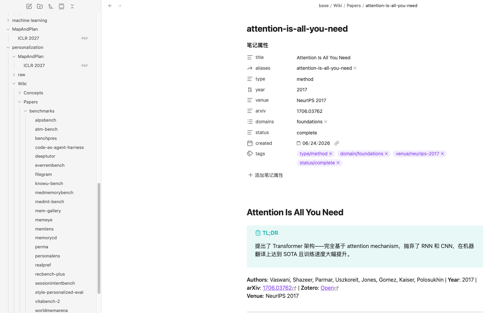

**`[[wiki-links]]` for concept cross-referencing (purple links):**

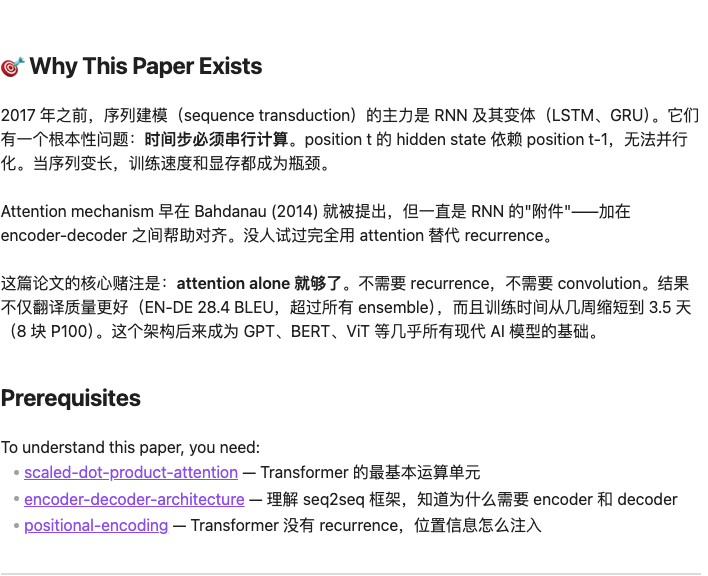

**LaTeX formula rendering — Attention & Multi-Head:**

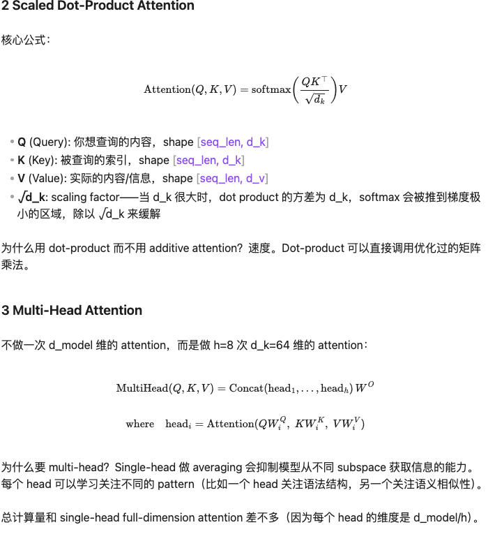

**More formulas — FFN & Positional Encoding (sin/cos):**

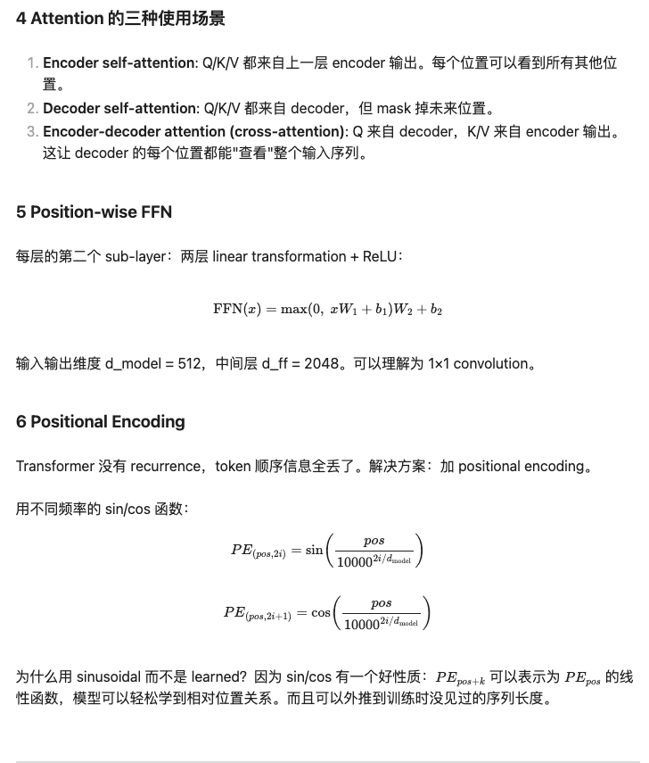

**`[!success]` callout — Key Innovation (green):**

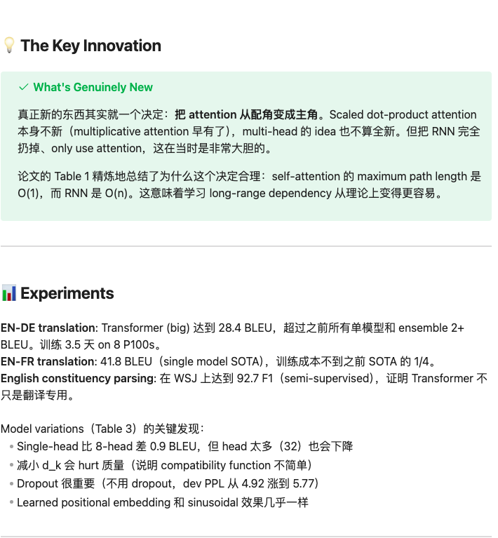

**`[!warning]` callout — Critical Assessment (orange) + Key Concepts wiki-links:**

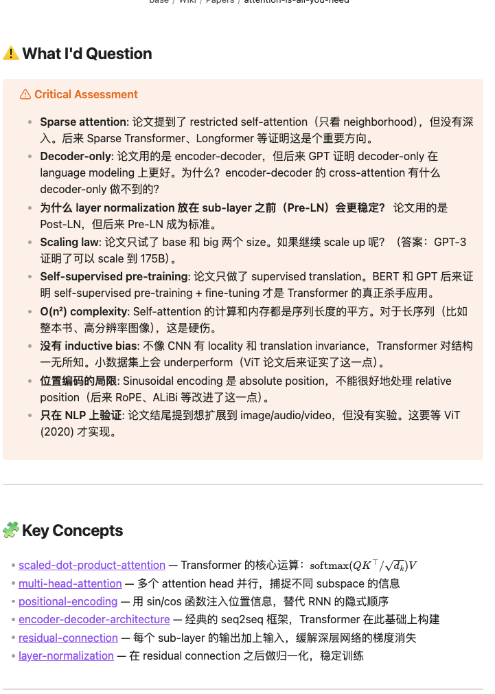

### Benchmark — [PersonaLens](demo/benchmarks/personalens.md)

ACL 2025 Findings — personalized dialogue evaluation across 20 domains.

**Dataview frontmatter + TL;DR callout:**

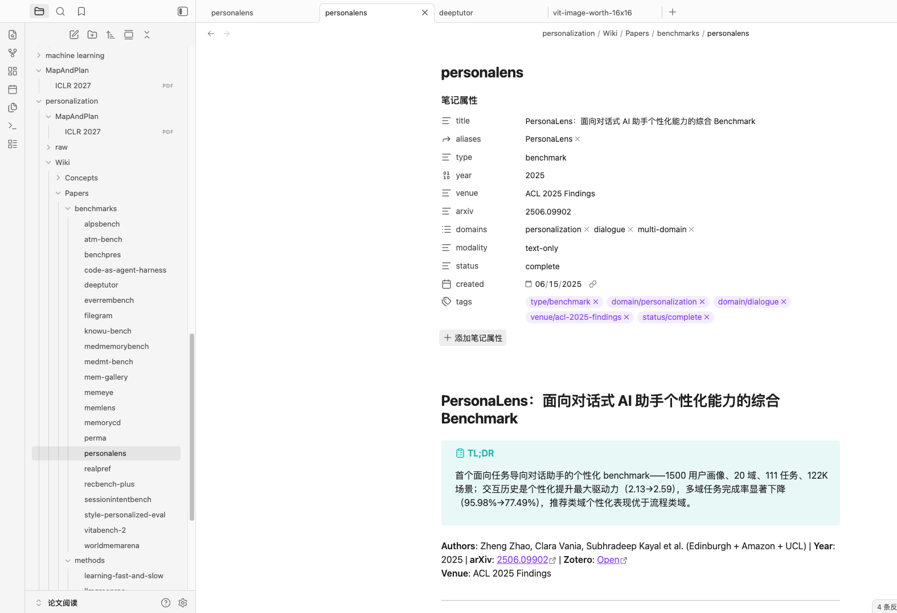

**Quick Reference table (10 dimensions):**

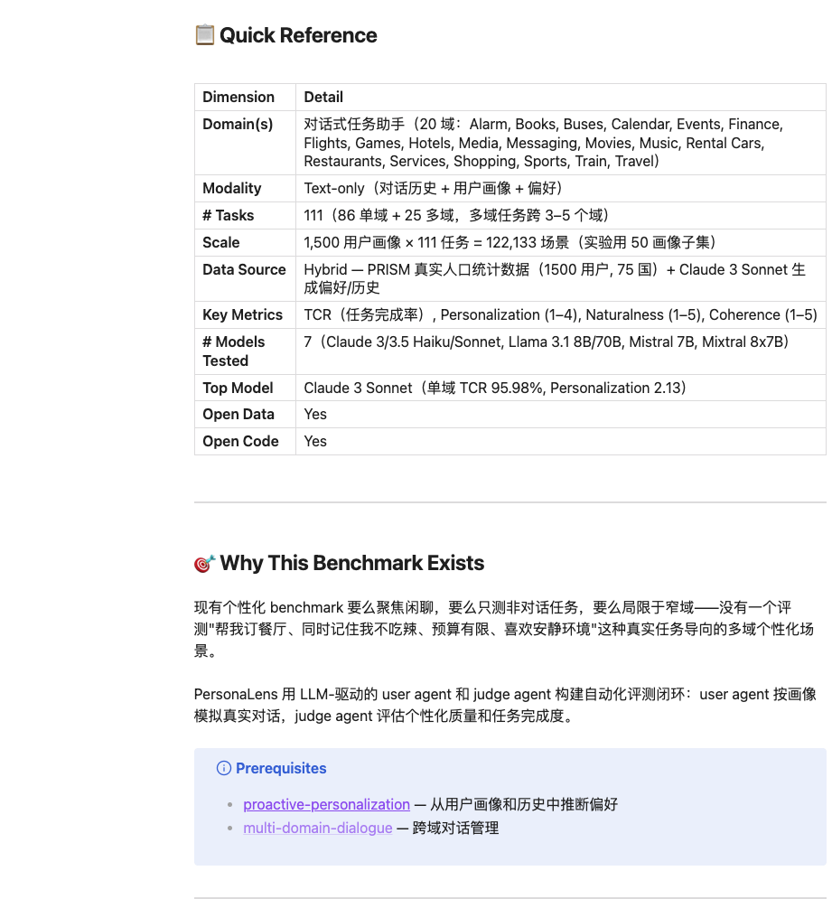

**Task Definitions with `[!example]` callout:**

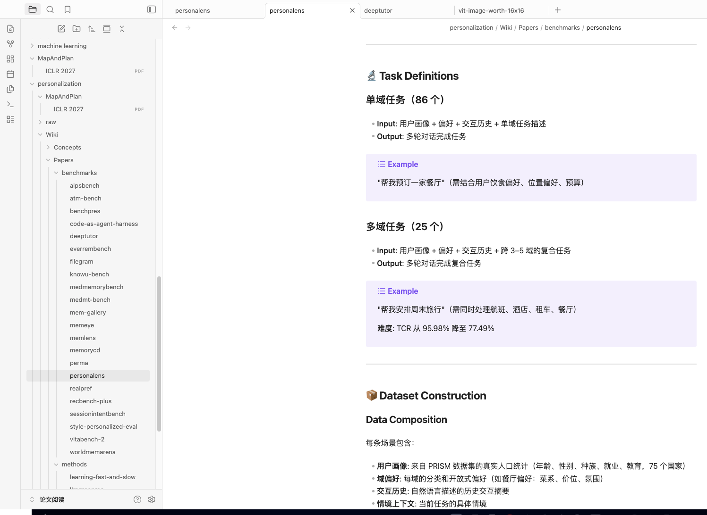

**Evaluation Framework + `[!info]` Personalization Rubric + Baseline Results table:**

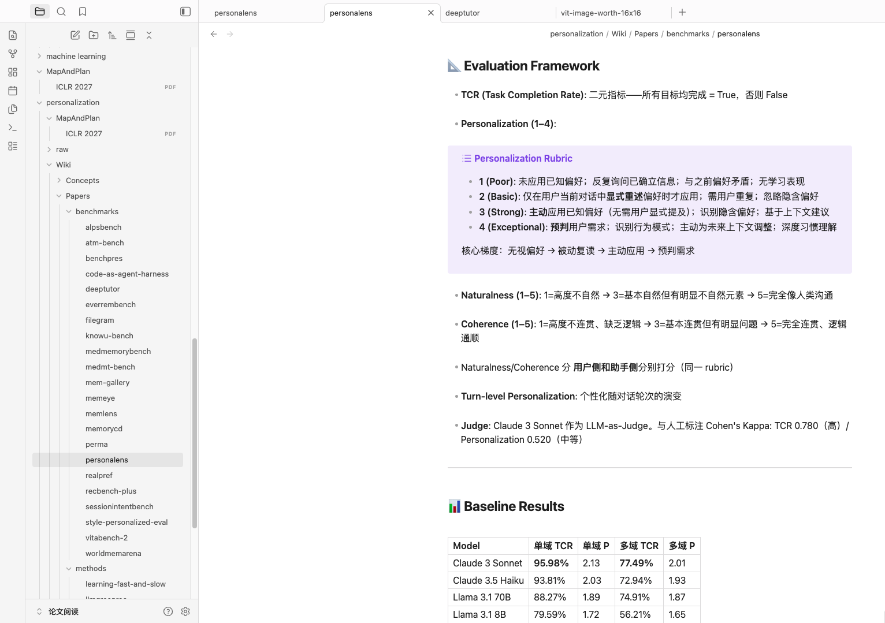

**`[!success]` Key Findings (green):**

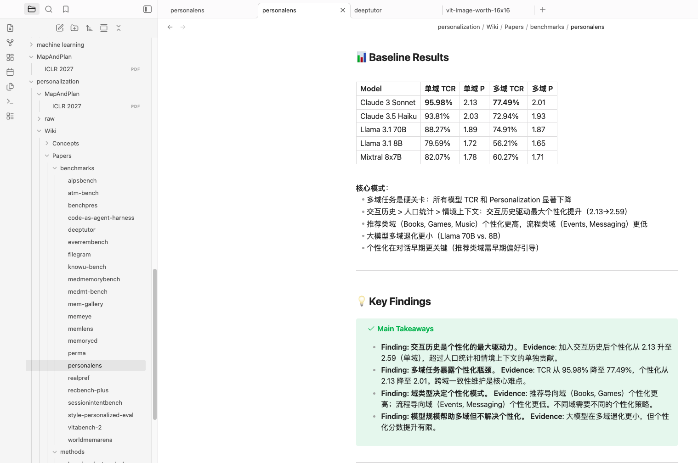

**`[!tip]` Adoption Guide + `[!warning]` Critical Assessment + Key Concepts wiki-links:**

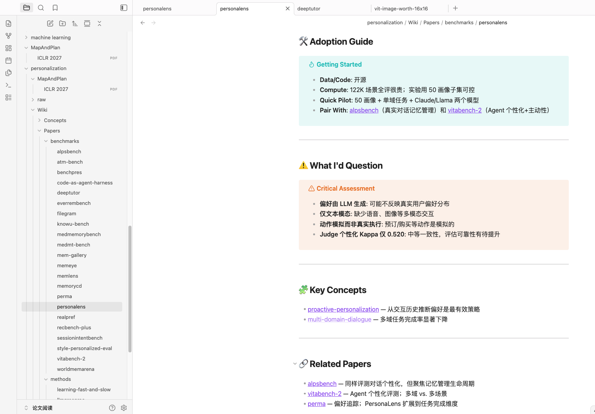

### Concept Entries

Linked from the method paper — showing the intuition-first Karpathy style:

| Entry | Key Feature |
|-------|-------------|
| [scaled-dot-product-attention.md](demo/concepts/scaled-dot-product-attention.md) | Core formula + "why √d_k" explanation |
| [multi-head-attention.md](demo/concepts/multi-head-attention.md) | Matrix dimension annotations (`$W_i^Q \in \mathbb{R}^{d \times d_k}$`) |
| [positional-encoding.md](demo/concepts/positional-encoding.md) | sin/cos formulas + RoPE/ALiBi variant comparison |

---

## 📁 Project Structure

```
paper-research-skill/
├── skills/                        # Skill definitions (all agents)
│   ├── paper-research/SKILL.md
│   ├── paper-fetch/SKILL.md
│   ├── paper-zotero/SKILL.md
│   ├── paper-wiki/
│   │   ├── SKILL.md
│   │   └── templates/             # On-demand templates (~60% token savings)
│   │       ├── benchmark.md
│   │       ├── method.md
│   │       ├── survey.md
│   │       ├── analysis.md
│   │       ├── framework.md
│   │       ├── technical-report.md
│   │       ├── synthesis.md
│   │       ├── concept.md
│   │       └── moc.md
│   └── paper-version/SKILL.md
├── .claude-plugin/plugin.json     # Claude Code plugin manifest
├── .agents/skills/                # Codex CLI skill discovery
├── demo/                          # Real wiki output examples
├── CHANGELOG.md
├── CLAUDE.md                      # Dev guidelines & versioning rules
├── README.md
└── README.zh-CN.md
```

---

## 📄 License

MIT © [Geek96](https://github.com/Geek96)
